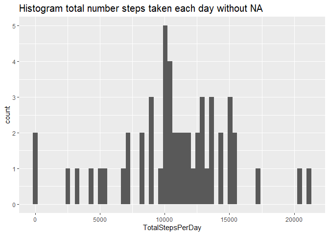
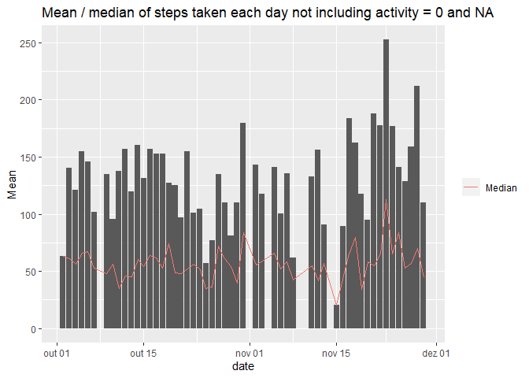
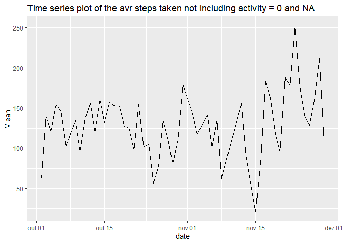
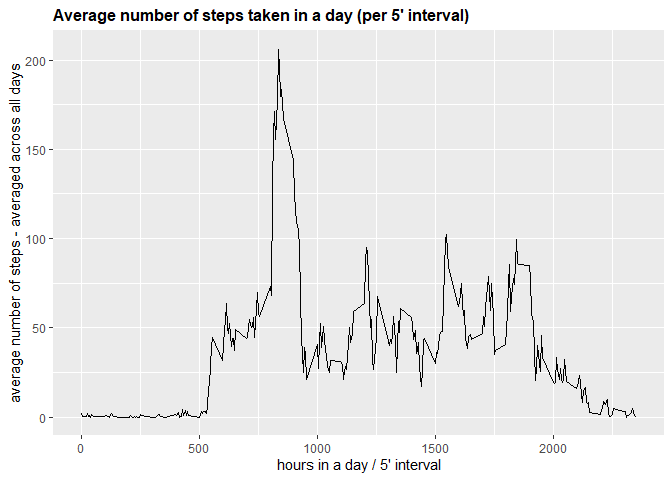
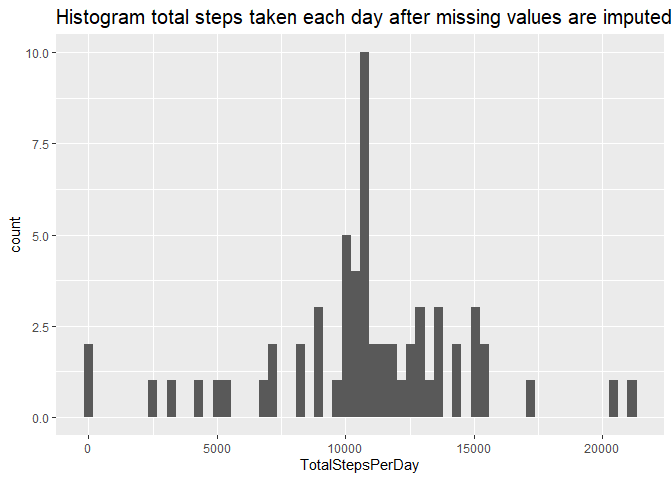
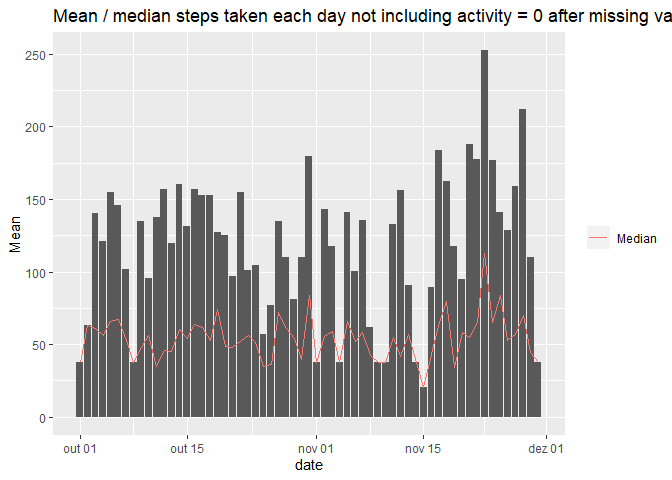
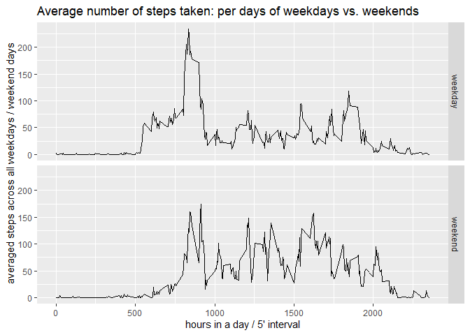

## 00 - Load librarys and options

```r
options(warn=-1)
library(ggplot2)
library(dplyr)
```

```
## 
## Attaching package: 'dplyr'
```

```
## The following objects are masked from 'package:stats':
## 
##     filter, lag
```

```
## The following objects are masked from 'package:base':
## 
##     intersect, setdiff, setequal, union
```

```r
library(BiocManager)
```

```
## Bioconductor version 3.12 (BiocManager 1.30.10), ?BiocManager::install for help
```

```r
library(hrbrthemes)
```

```
## NOTE: Either Arial Narrow or Roboto Condensed fonts are required to use these themes.
```

```
##       Please use hrbrthemes::import_roboto_condensed() to install Roboto Condensed and
```

```
##       if Arial Narrow is not on your system, please see https://bit.ly/arialnarrow
```

## 01a - Code for reading in the dataset and/or processing the data

```r
zipUrl = "https://d396qusza40orc.cloudfront.net/repdata%2Fdata%2Factivity.zip"
download.file(zipUrl,"repdata data activity.zip")
unzip("repdata data activity.zip")
repDataAct <- read.csv("activity.csv")
repDataAct <- mutate(repDataAct, date=as.Date(date, "%Y-%m-%d"))
```
## 01b - Data Sample

```r
print(head(repDataAct,10))
```

```
##    steps       date interval
## 1     NA 2012-10-01        0
## 2     NA 2012-10-01        5
## 3     NA 2012-10-01       10
## 4     NA 2012-10-01       15
## 5     NA 2012-10-01       20
## 6     NA 2012-10-01       25
## 7     NA 2012-10-01       30
## 8     NA 2012-10-01       35
## 9     NA 2012-10-01       40
## 10    NA 2012-10-01       45
```

## 02 - Histogram of the total number of steps taken each day not including NA

```r
repDataActClean <- filter(repDataAct, !is.na(steps))
total_per_day <- group_by(repDataActClean, date)
total_per_day <- summarize(total_per_day, TotalStepsPerDay=sum(steps))

ggplot(total_per_day, aes(x=TotalStepsPerDay)) +
    geom_histogram(bins=60) +
    ggtitle("Histogram total number steps taken each day without NA") +
    theme(
      plot.title = element_text(size=15)
    )
```

<!-- -->


## 03 - Mean and median number of steps taken each day not including activity = 0 and NA


```r
g <- group_by(repDataActClean, date)
g2 <- filter(g, steps > 0)
g2 <- summarize(g2, Mean=mean(steps), Median=median(steps))
print(g2)
```

```
## # A tibble: 53 x 3
##    date        Mean Median
##    <date>     <dbl>  <dbl>
##  1 2012-10-02  63     63  
##  2 2012-10-03 140.    61  
##  3 2012-10-04 121.    56.5
##  4 2012-10-05 155.    66  
##  5 2012-10-06 145.    67  
##  6 2012-10-07 102.    52.5
##  7 2012-10-09 135.    48  
##  8 2012-10-10  95.2   56.5
##  9 2012-10-11 137.    35  
## 10 2012-10-12 157.    46  
## # ... with 43 more rows
```

```r
ggplot(g2)+ 
        geom_col(aes(x = date, y = Mean))  +
        geom_line(aes(x = date, y = Median, col="red")) + 
        ggtitle("Mean / median of steps taken each day not including activity = 0 and NA") +
        theme(legend.title=element_blank()) +
        scale_color_hue(labels = c("Median"))
```

<!-- -->

```r
total_mean <- mean(filter(repDataActClean, steps > 0)$steps)
total_median <- median(filter(repDataActClean, steps > 0)$steps)
```
Total mean = 134.2607059  
Total median = 56

## 04 - Time series plot of the average number of steps taken not including activity = 0 and NA


```r
ggplot(g2, aes(x = date, y = Mean))+
        geom_line()+
        ggtitle("Time series plot of the avr steps taken not including activity = 0 and NA")
```

<!-- -->

## 05 - What is the average daily activity pattern?

```r
avg_by_interval <- select(repDataActClean, interval, steps)
avg_by_interval <- group_by(avg_by_interval, interval)
avg_by_interval <- summarize(avg_by_interval, AvgSteps=mean(steps))

g <- ggplot(avg_by_interval, aes(interval, AvgSteps))
g+ geom_line()+
  ggtitle("Average number of steps taken in a day (per 5' interval)")+
  xlab("hours in a day / 5' interval")+
  ylab("average number of steps - averaged across all days")+
  theme(plot.title = element_text(face="bold", size=12))
```

<!-- -->

## 05 - The 5-minute interval that, on average, contains the maximum number of steps

```r
avg_by_interval <- slice_head(arrange(avg_by_interval, desc(AvgSteps)),n=1)
avg_by_interval
```

```
## # A tibble: 1 x 2
##   interval AvgSteps
##      <int>    <dbl>
## 1      835     206.
```
## 06 - Code to describe and show a strategy for imputing missing data
### 06.1 Calculate and report the total number of missing values in the dataset

```r
naData <- filter(repDataAct , is.na(steps))
numMissingValues <- length(naData$steps)
```

Total of missing values: 2304

### 06.2 - Devise a strategy for filling in all of the missing values in the dataset. Create a new dataset that is equal to the original dataset but with the missing data filled in.

The strategy is to fill NA values with the total mean of steps of all the period, taking off the 0 steps recorded

```r
total_mean <- mean(repDataActClean$steps)
repDataActImputed <- mutate(repDataAct, steps = ifelse(is.na(steps),total_mean,steps))

naData2 <- filter(repDataActImputed , is.na(steps))
numMissingValues2 <- length(naData2$steps)
```
Missing values replaced by total mean: 37.3825996
Total of missing values after filling all the NA: 0

## 07 - Histogram of the total number of steps taken each day after missing values are imputed 

```r
total_per_day_imputed <- group_by(repDataActImputed, date)
total_per_day_imputed <- summarize(total_per_day_imputed, TotalStepsPerDay=sum(steps))

ggplot(total_per_day_imputed, aes(x=TotalStepsPerDay)) +
    geom_histogram(bins=60) +
    ggtitle("Histogram total steps taken each day after missing values are imputed") +
    theme(
      plot.title = element_text(size=15)
    )
```

<!-- -->


```r
g <- group_by(repDataActImputed, date)
g2 <- filter(g, steps > 0)
g2 <- summarize(g2, Mean=mean(steps), Median=median(steps))
print(g2)
```

```
## # A tibble: 61 x 3
##    date        Mean Median
##    <date>     <dbl>  <dbl>
##  1 2012-10-01  37.4   37.4
##  2 2012-10-02  63     63  
##  3 2012-10-03 140.    61  
##  4 2012-10-04 121.    56.5
##  5 2012-10-05 155.    66  
##  6 2012-10-06 145.    67  
##  7 2012-10-07 102.    52.5
##  8 2012-10-08  37.4   37.4
##  9 2012-10-09 135.    48  
## 10 2012-10-10  95.2   56.5
## # ... with 51 more rows
```

```r
ggplot(g2)+ 
        geom_col(aes(x = date, y = Mean))  +
        geom_line(aes(x = date, y = Median, col="red")) + 
        ggtitle("Mean / median steps each day not including activity = 0 and after NA are imputed") +
        theme(legend.title=element_blank()) +
        scale_color_hue(labels = c("Median"))
```

<!-- -->

```r
total_mean <- mean(filter(repDataActImputed, steps > 0)$steps)
total_median <- median(filter(repDataActImputed, steps > 0)$steps)
```

Total mean = 100.2040753  
Total median = 37.3825996


## 08 - Panel plot comparing the average number of steps taken per 5-minute interval across weekdays and weekends


```r
#creating week day type
repDataActImputed <- mutate(repDataAct, typeOfWeekDay = ifelse(as.numeric(strftime(date, "%u")) %in% c(6,7), "weekend", "weekday"))
repDataActImputed$typeOfWeekDay <- factor(repDataActImputed$typeOfWeekDay)


repDataActImputed <- select(repDataActImputed, typeOfWeekDay, interval, steps)
repDataActImputed <- filter(repDataActImputed, !is.na(steps))
repDataActImputed <- group_by(repDataActImputed, interval)
repDataActImputed <- group_by(repDataActImputed, typeOfWeekDay, .add=T)
repDataActImputed <- summarize(repDataActImputed, AvgSteps=mean(steps))
```

```
## `summarise()` has grouped output by 'interval'. You can override using the `.groups` argument.
```

```r
g<- ggplot(repDataActImputed, aes(x=interval, y=AvgSteps)) +
  geom_line() +
  ggtitle("Average number of steps taken: per days of weekdays vs. weekends")+
  xlab("hours in a day / 5' interval")+
  ylab("averaged steps across all weekdays / weekend days") +
  facet_grid(typeOfWeekDay ~ .)
print(g)
```

<!-- -->
